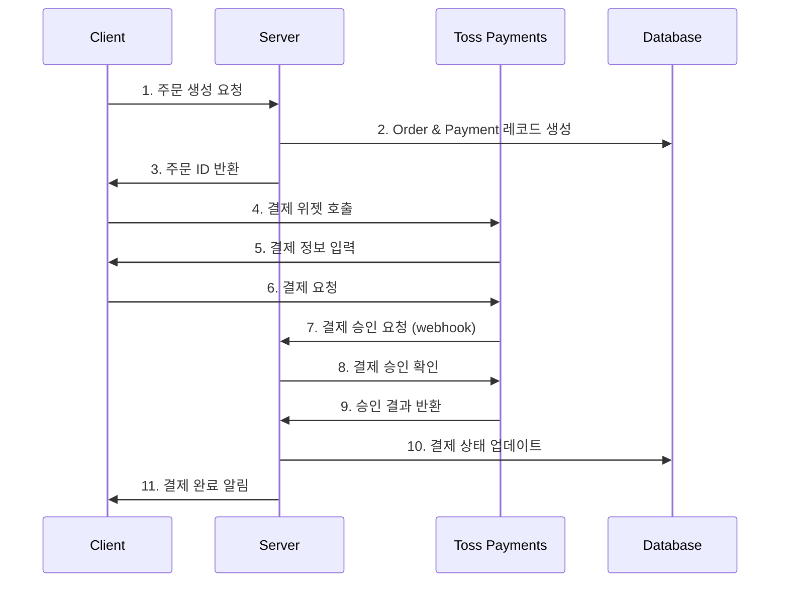

# 💳 결제 시스템 가이드

## 📋 개요

BogoFit Shop은 **Toss Payments**를 주 결제 서비스로 사용하며, 다양한 결제 수단을 지원합니다. 이 가이드는 결제 시스템의 구조와 구현 방법을 설명합니다.

## 🏗️ 결제 시스템 아키텍처

### 전체 결제 플로우



## 🛠️ Toss Payments 연동

### 1. 환경 설정

```bash
# .env.local
TOSS_PAYMENTS_SECRET_KEY="test_sk_your_secret_key"          # 테스트용
# TOSS_PAYMENTS_SECRET_KEY="live_sk_your_secret_key"       # 실서비스용

NEXT_PUBLIC_TOSS_PAYMENTS_CLIENT_KEY="test_ck_your_client_key"
```

### 2. 클라이언트 설정

#### 결제 위젯 초기화

```typescript
// src/components/payment/TossPaymentWidget.tsx
import { loadTossPayments } from "@tosspayments/payment-sdk";
import { useEffect, useState } from "react";

const TossPaymentWidget: React.FC<{
  orderId: string;
  amount: number;
  customerName: string;
}> = ({ orderId, amount, customerName }) => {
  const [tossPayments, setTossPayments] = useState(null);

  useEffect(() => {
    const initializeTossPayments = async () => {
      const toss = await loadTossPayments(
        process.env.NEXT_PUBLIC_TOSS_PAYMENTS_CLIENT_KEY!
      );
      setTossPayments(toss);
    };

    initializeTossPayments();
  }, []);

  const handlePayment = async () => {
    if (!tossPayments) return;

    try {
      await tossPayments.requestPayment("카드", {
        amount,
        orderId,
        orderName: "상품 주문",
        customerName,
        successUrl: `${window.location.origin}/success`,
        failUrl: `${window.location.origin}/fail`,
      });
    } catch (error) {
      console.error("결제 요청 실패:", error);
    }
  };

  return (
    <div className="payment-widget">
      <button
        onClick={handlePayment}
        className="w-full bg-blue-600 text-white py-3 rounded-lg"
      >
        결제하기
      </button>
    </div>
  );
};
```

#### 결제 방법별 구현

```typescript
// 카드 결제
const requestCardPayment = async () => {
  await tossPayments.requestPayment("카드", {
    amount: 29000,
    orderId: "order_123",
    orderName: "BogoFit 상품",
    customerName: "홍길동",
    successUrl: "https://shop.bogofit.kr/success",
    failUrl: "https://shop.bogofit.kr/fail",
  });
};

// 계좌이체
const requestTransferPayment = async () => {
  await tossPayments.requestPayment("계좌이체", {
    amount: 29000,
    orderId: "order_123",
    orderName: "BogoFit 상품",
    customerName: "홍길동",
    successUrl: "https://shop.bogofit.kr/success",
    failUrl: "https://shop.bogofit.kr/fail",
  });
};

// 가상계좌
const requestVirtualAccountPayment = async () => {
  await tossPayments.requestPayment("가상계좌", {
    amount: 29000,
    orderId: "order_123",
    orderName: "BogoFit 상품",
    customerName: "홍길동",
    validHours: 24, // 24시간 유효
    successUrl: "https://shop.bogofit.kr/success",
    failUrl: "https://shop.bogofit.kr/fail",
  });
};

// 휴대폰 결제
const requestMobilePayment = async () => {
  await tossPayments.requestPayment("휴대폰", {
    amount: 29000,
    orderId: "order_123",
    orderName: "BogoFit 상품",
    customerName: "홍길동",
    successUrl: "https://shop.bogofit.kr/success",
    failUrl: "https://shop.bogofit.kr/fail",
  });
};
```

### 3. 서버 API 연동

#### 결제 승인 API

```typescript
// src/app/api/confirm/payment/route.ts
import { NextRequest, NextResponse } from "next/server";
import { prisma } from "@/lib/prisma";

const encryptedApiSecretKey = `Basic ${Buffer.from(
  process.env.TOSS_PAYMENTS_SECRET_KEY + ":"
).toString("base64")}`;

export async function POST(request: NextRequest) {
  try {
    const body = await request.json();
    const { paymentKey, orderId, amount } = body;

    // 1. Toss Payments API로 결제 승인
    const response = await fetch(
      "https://api.tosspayments.com/v1/payments/confirm",
      {
        method: "POST",
        headers: {
          Authorization: encryptedApiSecretKey,
          "Content-Type": "application/json",
        },
        body: JSON.stringify({
          orderId,
          amount,
          paymentKey,
        }),
      }
    );

    if (!response.ok) {
      const errorData = await response.json();
      console.error("Toss Payments API Error:", errorData);

      // 결제 실패 시 DB 업데이트
      await prisma.$transaction(async (tx) => {
        await tx.payment.update({
          where: { orderId },
          data: { status: "FAILED", failReason: errorData.message },
        });

        await tx.order.update({
          where: { id: orderId },
          data: { status: "FAILED" },
        });
      });

      return NextResponse.json(
        {
          error: true,
          message: errorData.message || "결제 처리 중 오류가 발생했습니다.",
          code: errorData.code,
        },
        { status: response.status }
      );
    }

    const result = await response.json();
    console.log("결제 승인 성공:", result);

    // 2. 결제 성공 시 DB 업데이트
    await prisma.$transaction(async (tx) => {
      await tx.payment.update({
        where: { orderId },
        data: {
          status: "COMPLETED",
          paymentKey,
          method: result.method,
          approvedAt: new Date(result.approvedAt),
        },
      });

      await tx.order.update({
        where: { id: orderId },
        data: { status: "PAID" },
      });
    });

    // 3. 결제 완료 후 처리 (SMS, 이메일 등)
    // ... 추가 로직

    return NextResponse.json(result);
  } catch (error) {
    console.error("결제 승인 서버 오류:", error);
    return NextResponse.json(
      {
        error: true,
        message: "서버 오류가 발생했습니다.",
      },
      { status: 500 }
    );
  }
}
```

#### 결제 준비 API

```typescript
// src/app/api/payment/prepare/route.ts
export async function POST(request: NextRequest) {
  try {
    const body = await request.json();
    const { items, customerInfo, shippingInfo, totalAmount } = body;

    // 1. 주문 생성
    const order = await prisma.order.create({
      data: {
        orderNumber: generateOrderNumber(),
        totalAmount,
        status: "PENDING",

        // 주문자 정보
        ordererName: customerInfo.name,
        ordererEmail: customerInfo.email,
        ordererPhone: customerInfo.phone,

        // 배송지 정보
        recipientName: shippingInfo.recipientName,
        recipientPhone: shippingInfo.recipientPhone,
        zipCode: shippingInfo.zipCode,
        address1: shippingInfo.address1,
        address2: shippingInfo.address2,

        // 통관 정보
        customsId: shippingInfo.customsId,
        agreePrivacy: true,

        // 게스트 주문 처리
        isGuestOrder: !customerInfo.userId,
        userId: customerInfo.userId || null,
      },
    });

    // 2. 주문 상품 생성
    for (const item of items) {
      await prisma.orderItem.create({
        data: {
          orderId: order.id,
          productId: item.productId,
          variantId: item.variantId,
          quantity: item.quantity,
          unitPrice: item.price,
        },
      });
    }

    // 3. 결제 레코드 생성
    const payment = await prisma.payment.create({
      data: {
        orderId: order.id,
        userId: customerInfo.userId || null,
        amount: totalAmount,
        status: "PENDING",
      },
    });

    return NextResponse.json({
      orderId: order.id,
      orderNumber: order.orderNumber,
      amount: totalAmount,
      paymentId: payment.id,
    });
  } catch (error) {
    console.error("결제 준비 오류:", error);
    return NextResponse.json(
      {
        error: "결제 준비 중 오류가 발생했습니다.",
      },
      { status: 500 }
    );
  }
}

// 주문번호 생성 함수
function generateOrderNumber(): string {
  const date = new Date();
  const dateStr = date.toISOString().slice(2, 10).replace(/-/g, "");
  const randomStr = Math.random().toString(36).substring(2, 8).toUpperCase();
  return `${dateStr}-${randomStr}`;
}
```

## 🔄 결제 상태 관리

### 결제 상태 정의

```typescript
// 결제 상태
type PaymentStatus =
  | "PENDING" // 대기중
  | "PROCESSING" // 처리중
  | "COMPLETED" // 완료
  | "FAILED" // 실패
  | "CANCELLED" // 취소됨
  | "REFUNDED"; // 환불됨

// 주문 상태
type OrderStatus =
  | "PENDING" // 대기중
  | "PAID" // 결제완료
  | "SHIPPING" // 배송중
  | "COMPLETED" // 완료
  | "CANCELLED" // 취소
  | "FAILED"; // 실패
```

### 상태 전환 로직

```typescript
// 결제 상태에 따른 주문 상태 업데이트
const updateOrderStatus = async (
  paymentStatus: PaymentStatus,
  orderId: string
) => {
  let orderStatus: OrderStatus;

  switch (paymentStatus) {
    case "COMPLETED":
      orderStatus = "PAID";
      break;
    case "FAILED":
    case "CANCELLED":
      orderStatus = "FAILED";
      break;
    default:
      orderStatus = "PENDING";
  }

  await prisma.order.update({
    where: { id: orderId },
    data: { status: orderStatus },
  });
};
```

## 💰 결제 수단별 특이사항

### 1. 카드 결제

```typescript
const cardPaymentOptions = {
  amount: 29000,
  orderId: "order_123",
  orderName: "BogoFit 상품",
  customerName: "홍길동",
  customerEmail: "customer@example.com",

  // 카드 결제 특화 옵션
  card: {
    useEscrow: false, // 에스크로 사용 여부
    flowMode: "DEFAULT", // 결제 플로우 모드
    useCardPoint: false, // 카드사 포인트 사용 여부
    useAppCardOnly: false, // 앱카드만 허용 여부
  },

  successUrl: "https://shop.bogofit.kr/success",
  failUrl: "https://shop.bogofit.kr/fail",
};
```

### 2. 가상계좌

```typescript
const virtualAccountOptions = {
  amount: 29000,
  orderId: "order_123",
  orderName: "BogoFit 상품",
  customerName: "홍길동",

  // 가상계좌 특화 옵션
  virtualAccount: {
    validHours: 24, // 입금 유효 시간 (시간)
    cashReceiptType: "소득공제", // 현금영수증 타입
    customerIdentityNumber: "", // 현금영수증 발행용 식별번호
  },

  successUrl: "https://shop.bogofit.kr/success",
  failUrl: "https://shop.bogofit.kr/fail",
};
```

### 3. 휴대폰 결제

```typescript
const mobilePaymentOptions = {
  amount: 29000,
  orderId: "order_123",
  orderName: "BogoFit 상품",
  customerName: "홍길동",

  // 휴대폰 결제 특화 옵션
  mobilePhone: {
    settlementStatus: "INCOMPLETED", // 정산 상태
    cashReceiptType: "소득공제",
  },

  successUrl: "https://shop.bogofit.kr/success",
  failUrl: "https://shop.bogofit.kr/fail",
};
```

## 🔍 결제 내역 조회

### 결제 내역 API

```typescript
// src/app/api/payment/history/route.ts
export async function GET(request: NextRequest) {
  try {
    const { searchParams } = new URL(request.url);
    const userId = searchParams.get("userId");
    const page = parseInt(searchParams.get("page") || "1");
    const limit = parseInt(searchParams.get("limit") || "10");

    if (!userId) {
      return NextResponse.json(
        { error: "사용자 ID가 필요합니다." },
        { status: 400 }
      );
    }

    const payments = await prisma.payment.findMany({
      where: { userId },
      include: {
        order: {
          include: {
            items: {
              include: {
                product: {
                  select: {
                    id: true,
                    title: true,
                    imageUrl: true,
                  },
                },
              },
            },
          },
        },
      },
      orderBy: { createdAt: "desc" },
      skip: (page - 1) * limit,
      take: limit,
    });

    const totalCount = await prisma.payment.count({
      where: { userId },
    });

    return NextResponse.json({
      payments,
      pagination: {
        page,
        limit,
        totalCount,
        totalPages: Math.ceil(totalCount / limit),
      },
    });
  } catch (error) {
    console.error("결제 내역 조회 오류:", error);
    return NextResponse.json(
      { error: "결제 내역 조회 중 오류가 발생했습니다." },
      { status: 500 }
    );
  }
}
```

### 결제 상세 조회

```typescript
// 특정 결제의 상세 정보 조회
const getPaymentDetail = async (paymentKey: string) => {
  const response = await fetch(
    `https://api.tosspayments.com/v1/payments/${paymentKey}`,
    {
      headers: {
        Authorization: encryptedApiSecretKey,
      },
    }
  );

  if (!response.ok) {
    throw new Error("결제 정보 조회 실패");
  }

  return response.json();
};
```

## 🔄 환불 및 취소

### 결제 취소 API

```typescript
// src/app/api/payment/cancel/route.ts
export async function POST(request: NextRequest) {
  try {
    const { paymentKey, cancelReason, cancelAmount } = await request.json();

    // 1. Toss Payments 취소 요청
    const response = await fetch(
      `https://api.tosspayments.com/v1/payments/${paymentKey}/cancel`,
      {
        method: "POST",
        headers: {
          Authorization: encryptedApiSecretKey,
          "Content-Type": "application/json",
        },
        body: JSON.stringify({
          cancelReason,
          cancelAmount, // 부분 취소 시 금액 지정
        }),
      }
    );

    if (!response.ok) {
      const errorData = await response.json();
      return NextResponse.json(
        {
          error: true,
          message: errorData.message,
        },
        { status: response.status }
      );
    }

    const result = await response.json();

    // 2. DB 상태 업데이트
    await prisma.$transaction(async (tx) => {
      const payment = await tx.payment.findFirst({
        where: { paymentKey },
        include: { order: true },
      });

      if (!payment) {
        throw new Error("결제 정보를 찾을 수 없습니다.");
      }

      // 결제 상태 업데이트
      await tx.payment.update({
        where: { id: payment.id },
        data: {
          status: "CANCELLED",
          failReason: cancelReason,
        },
      });

      // 주문 상태 업데이트
      await tx.order.update({
        where: { id: payment.orderId },
        data: { status: "CANCELLED" },
      });
    });

    return NextResponse.json({
      success: true,
      message: "결제가 성공적으로 취소되었습니다.",
      data: result,
    });
  } catch (error) {
    console.error("결제 취소 오류:", error);
    return NextResponse.json(
      {
        error: true,
        message: "결제 취소 중 오류가 발생했습니다.",
      },
      { status: 500 }
    );
  }
}
```

### 부분 환불 처리

```typescript
// 부분 환불 로직
const processPartialRefund = async (
  paymentKey: string,
  refundAmount: number,
  refundReason: string
) => {
  try {
    const response = await fetch(
      `https://api.tosspayments.com/v1/payments/${paymentKey}/cancel`,
      {
        method: "POST",
        headers: {
          Authorization: encryptedApiSecretKey,
          "Content-Type": "application/json",
        },
        body: JSON.stringify({
          cancelAmount: refundAmount,
          cancelReason: refundReason,
          refundReceiveAccount: {
            bank: "카카오뱅크",
            accountNumber: "1234567890",
            holderName: "홍길동",
          },
        }),
      }
    );

    return await response.json();
  } catch (error) {
    console.error("부분 환불 처리 오류:", error);
    throw error;
  }
};
```

## 🔔 웹훅 처리

### 결제 상태 변경 웹훅

```typescript
// src/app/api/webhook/payment/route.ts
export async function POST(request: NextRequest) {
  try {
    const signature = request.headers.get("toss-signature");
    const body = await request.text();

    // 웹훅 검증 (선택사항)
    if (!verifyWebhookSignature(signature, body)) {
      return NextResponse.json(
        { error: "웹훅 서명 검증 실패" },
        { status: 401 }
      );
    }

    const data = JSON.parse(body);
    const { eventType, data: paymentData } = data;

    switch (eventType) {
      case "PAYMENT_STATUS_CHANGED":
        await handlePaymentStatusChange(paymentData);
        break;

      case "VIRTUAL_ACCOUNT_ISSUED":
        await handleVirtualAccountIssued(paymentData);
        break;

      case "VIRTUAL_ACCOUNT_DEPOSITED":
        await handleVirtualAccountDeposited(paymentData);
        break;

      default:
        console.log("처리되지 않은 웹훅 이벤트:", eventType);
    }

    return NextResponse.json({ received: true });
  } catch (error) {
    console.error("웹훅 처리 오류:", error);
    return NextResponse.json({ error: "웹훅 처리 실패" }, { status: 500 });
  }
}

// 웹훅 서명 검증
function verifyWebhookSignature(signature: string, body: string): boolean {
  // Toss Payments 웹훅 서명 검증 로직
  // 실제 구현 시 공식 문서 참조
  return true; // 임시
}
```

## 🧪 테스트 방법

### 테스트 카드 정보

```typescript
// 테스트용 카드 번호 (Toss Payments)
const testCards = {
  success: "4282000000004282", // 성공
  fail: "4282000000004001", // 실패
  authFail: "4282000000004309", // 인증 실패
  insufficientFunds: "4282000000004051", // 잔액 부족
};

// 테스트 환경에서만 사용
const isTestMode =
  process.env.NODE_ENV === "development" ||
  process.env.TOSS_PAYMENTS_SECRET_KEY?.includes("test_");
```

### E2E 테스트

```typescript
// cypress/e2e/payment.cy.ts
describe("결제 플로우 테스트", () => {
  it("카드 결제 성공 플로우", () => {
    cy.visit("/cart");

    // 장바구니에서 결제 진행
    cy.get('[data-testid="checkout-button"]').click();

    // 주문 정보 입력
    cy.get('[data-testid="customer-name"]').type("홍길동");
    cy.get('[data-testid="customer-phone"]').type("01012345678");

    // 결제 진행
    cy.get('[data-testid="payment-button"]').click();

    // 결제 성공 페이지 확인
    cy.url().should("include", "/success");
    cy.get('[data-testid="success-message"]').should(
      "contain",
      "결제가 완료되었습니다"
    );
  });

  it("결제 실패 플로우", () => {
    // 실패 시나리오 테스트
  });
});
```

### 단위 테스트

```typescript
// __tests__/payment.test.ts
import { processPayment } from "@/lib/payment";

describe("결제 처리 로직", () => {
  test("결제 승인 성공", async () => {
    const paymentData = {
      paymentKey: "test_payment_key",
      orderId: "test_order_123",
      amount: 29000,
    };

    const result = await processPayment(paymentData);

    expect(result.success).toBe(true);
    expect(result.orderId).toBe(paymentData.orderId);
  });

  test("결제 승인 실패", async () => {
    // 실패 케이스 테스트
  });
});
```

## 🔐 보안 고려사항

### API 키 보안

```typescript
// 서버에서만 사용하는 시크릿 키
const TOSS_SECRET_KEY = process.env.TOSS_PAYMENTS_SECRET_KEY;

// 클라이언트에서 사용하는 퍼블릭 키
const TOSS_CLIENT_KEY = process.env.NEXT_PUBLIC_TOSS_PAYMENTS_CLIENT_KEY;

// API 요청 시 인증 헤더
const authHeader = `Basic ${Buffer.from(TOSS_SECRET_KEY + ":").toString(
  "base64"
)}`;
```

### 결제 데이터 검증

```typescript
// 결제 금액 검증
const validatePaymentAmount = async (orderId: string, amount: number) => {
  const order = await prisma.order.findUnique({
    where: { id: orderId },
    include: { items: true },
  });

  if (!order) {
    throw new Error("주문을 찾을 수 없습니다.");
  }

  // 클라이언트에서 전송된 금액과 서버의 계산된 금액 비교
  const calculatedAmount = order.items.reduce(
    (sum, item) => sum + item.unitPrice * item.quantity,
    0
  );

  if (calculatedAmount !== amount) {
    throw new Error("결제 금액이 일치하지 않습니다.");
  }

  return true;
};
```

### 중복 결제 방지

```typescript
// 멱등성 키를 사용한 중복 결제 방지
const processPaymentWithIdempotency = async (
  paymentData: any,
  idempotencyKey: string
) => {
  // 이미 처리된 요청인지 확인
  const existingPayment = await prisma.payment.findFirst({
    where: {
      orderId: paymentData.orderId,
      status: "COMPLETED",
    },
  });

  if (existingPayment) {
    return {
      success: true,
      message: "이미 처리된 결제입니다.",
      paymentId: existingPayment.id,
    };
  }

  // 새로운 결제 처리
  return processPayment(paymentData);
};
```

## 📊 결제 통계 및 분석

### 결제 통계 조회

```typescript
// 일별 결제 통계
const getDailyPaymentStats = async (date: string) => {
  const stats = await prisma.payment.groupBy({
    by: ["status"],
    where: {
      createdAt: {
        gte: new Date(`${date}T00:00:00.000Z`),
        lte: new Date(`${date}T23:59:59.999Z`),
      },
    },
    _sum: { amount: true },
    _count: { id: true },
  });

  return stats.reduce((acc, stat) => {
    acc[stat.status] = {
      count: stat._count.id,
      totalAmount: stat._sum.amount || 0,
    };
    return acc;
  }, {} as Record<string, any>);
};

// 결제 수단별 통계
const getPaymentMethodStats = async (startDate: string, endDate: string) => {
  return await prisma.payment.groupBy({
    by: ["method"],
    where: {
      createdAt: {
        gte: new Date(startDate),
        lte: new Date(endDate),
      },
      status: "COMPLETED",
    },
    _sum: { amount: true },
    _count: { id: true },
  });
};
```

## 📚 참고 자료

- **Toss Payments 공식 문서**: https://docs.tosspayments.com/
- **Toss Payments SDK**: https://github.com/tosspayments/payment-sdk
- **결제 PG 연동 가이드**: https://docs.bogofit.kr/payment-integration

---

**💡 결제 시스템은 보안이 매우 중요합니다. 실제 운영 시에는 반드시 충분한 테스트를 거쳐주세요!**
