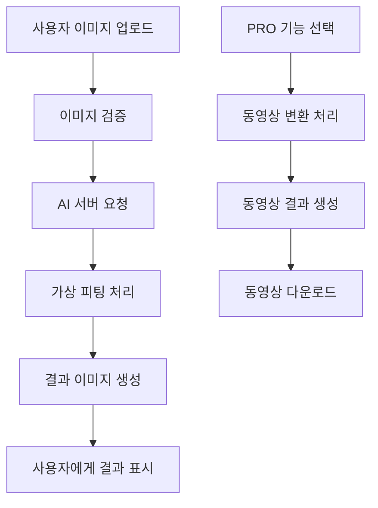

# 🤖 AI 가상 피팅 시스템 가이드

## 📋 개요

BogoFit Shop의 AI 가상 피팅 시스템은 사용자가 실제로 옷을 입어보지 않고도 AI 기술을 통해 가상으로 착용해볼 수 있는 혁신적인 기능입니다.

## 🎯 주요 기능

### 🖼️ 기본 기능

- **실시간 이미지 생성**: 사용자 사진에 의류를 실시간으로 합성
- **다중 아이템 지원**: 상의, 하의, 아우터 동시 착용 가능
- **진행률 표시**: 처리 과정을 시각적으로 표시하는 프로그레스 바
- **파일 검증**: 이미지 파일 형식 및 크기 자동 검증

### 🎬 PRO 기능 (동영상)

- **동영상 변환**: 정적 이미지를 동적 영상으로 변환
- **움직임 시뮬레이션**: 자연스러운 몸짓과 의류 흔들림 표현
- **다각도 뷰**: 여러 각도에서의 착용 모습 확인

## 🏗️ 시스템 아키텍처

### 전체 플로우



### 컴포넌트 구조

```
src/components/product/
├── VirtualFitting.tsx          # 메인 가상 피팅 컴포넌트
├── Cafe24VirtualFitting.tsx    # Cafe24 상품용 가상 피팅
└── PurchaseButton.tsx          # 구매 버튼 (가상 피팅 연동)

src/contents/VirtualFitting/
└── sampleImages.ts             # 샘플 이미지 데이터
```

## 🛠️ 구현 상세

### 1. 메인 가상 피팅 컴포넌트

#### VirtualFitting.tsx

```typescript
interface VirtualFittingProps {
  productId?: number;
  productImageUrl?: string;
  productTitle?: string;
}

const VirtualFitting: React.FC<VirtualFittingProps> = ({
  productId,
  productImageUrl,
  productTitle
}) => {
  // 상태 관리
  const [selectedHumanImage, setSelectedHumanImage] = useState<string>("");
  const [uploadedImage, setUploadedImage] = useState<string>("");
  const [isProcessing, setIsProcessing] = useState(false);
  const [progress, setProgress] = useState(0);
  const [resultImageUrl, setResultImageUrl] = useState<string>("");

  // PRO 기능 상태
  const [isProMode, setIsProMode] = useState(false);
  const [videoResult, setVideoResult] = useState<string>("");

  // 가상 피팅 실행
  const handleVirtualFitting = async () => {
    // 구현 로직...
  };

  return (
    // UI 렌더링...
  );
};
```

### 2. API 연동

#### 가상 피팅 API 요청

```typescript
// 기본 이미지 생성
const generateFittingImage = async (
  humanImage: string,
  garmentImage: string
) => {
  const response = await fetch("/api/virtual-fitting/generate", {
    method: "POST",
    headers: { "Content-Type": "application/json" },
    body: JSON.stringify({
      humanImageUrl: humanImage,
      garmentImageUrl: garmentImage,
      type: "image",
    }),
  });

  return response.json();
};

// PRO 동영상 생성
const generateFittingVideo = async (resultImageUrl: string) => {
  const response = await fetch("/api/virtual-fitting/generate-video", {
    method: "POST",
    headers: { "Content-Type": "application/json" },
    body: JSON.stringify({
      imageUrl: resultImageUrl,
      duration: 5, // 5초 동영상
      style: "natural", // 자연스러운 움직임
    }),
  });

  return response.json();
};
```

### 3. 진행률 표시 시스템

```typescript
const ProgressIndicator: React.FC<{ progress: number }> = ({ progress }) => {
  const stages = [
    { step: 0, label: "준비 중..." },
    { step: 25, label: "이미지 분석 중..." },
    { step: 50, label: "AI 처리 중..." },
    { step: 75, label: "결과 생성 중..." },
    { step: 100, label: "완료!" },
  ];

  const currentStage = stages.reduce((current, stage) =>
    progress >= stage.step ? stage : current
  );

  return (
    <div className="w-full">
      <div className="flex justify-between text-sm text-gray-600 mb-2">
        <span>{currentStage.label}</span>
        <span>{progress}%</span>
      </div>
      <div className="w-full bg-gray-200 rounded-full h-2">
        <div
          className="bg-blue-600 h-2 rounded-full transition-all duration-300"
          style={{ width: `${progress}%` }}
        />
      </div>
    </div>
  );
};
```

## 📸 이미지 처리

### 지원 파일 형식

- **형식**: JPEG, PNG, WebP
- **최대 크기**: 10MB
- **권장 해상도**: 512x512 ~ 1024x1024px
- **종횡비**: 3:4 (세로가 긴 형태 권장)

### 이미지 검증 로직

```typescript
const validateImage = (file: File): Promise<boolean> => {
  return new Promise((resolve, reject) => {
    // 파일 크기 검증
    if (file.size > 10 * 1024 * 1024) {
      // 10MB
      reject(new Error("파일 크기는 10MB 이하여야 합니다."));
      return;
    }

    // 파일 형식 검증
    const allowedTypes = ["image/jpeg", "image/png", "image/webp"];
    if (!allowedTypes.includes(file.type)) {
      reject(new Error("JPEG, PNG, WebP 형식만 지원합니다."));
      return;
    }

    // 이미지 크기 검증
    const img = new Image();
    img.onload = () => {
      if (img.width < 256 || img.height < 256) {
        reject(new Error("이미지 크기는 최소 256x256px 이상이어야 합니다."));
        return;
      }
      resolve(true);
    };
    img.onerror = () => reject(new Error("유효하지 않은 이미지 파일입니다."));
    img.src = URL.createObjectURL(file);
  });
};
```

### 이미지 최적화

```typescript
const optimizeImage = (file: File, maxWidth: number = 1024): Promise<Blob> => {
  return new Promise((resolve) => {
    const canvas = document.createElement("canvas");
    const ctx = canvas.getContext("2d");
    const img = new Image();

    img.onload = () => {
      const ratio = Math.min(maxWidth / img.width, maxWidth / img.height);
      canvas.width = img.width * ratio;
      canvas.height = img.height * ratio;

      ctx?.drawImage(img, 0, 0, canvas.width, canvas.height);
      canvas.toBlob(resolve as BlobCallback, "image/jpeg", 0.9);
    };

    img.src = URL.createObjectURL(file);
  });
};
```

## 🎨 사용자 인터페이스

### 1. 이미지 업로드 영역

```typescript
const ImageUploadArea: React.FC = () => {
  const [isDragOver, setIsDragOver] = useState(false);

  const handleDrop = (e: React.DragEvent) => {
    e.preventDefault();
    setIsDragOver(false);

    const files = Array.from(e.dataTransfer.files);
    const imageFile = files.find((file) => file.type.startsWith("image/"));

    if (imageFile) {
      handleImageUpload(imageFile);
    }
  };

  return (
    <div
      className={`border-2 border-dashed rounded-lg p-8 text-center transition-colors ${
        isDragOver ? "border-blue-400 bg-blue-50" : "border-gray-300"
      }`}
      onDrop={handleDrop}
      onDragOver={(e) => {
        e.preventDefault();
        setIsDragOver(true);
      }}
      onDragLeave={() => setIsDragOver(false)}
    >
      <div className="flex flex-col items-center">
        <Upload className="w-12 h-12 text-gray-400 mb-4" />
        <p className="text-lg font-medium text-gray-700 mb-2">
          이미지를 드래그하거나 클릭해서 업로드
        </p>
        <p className="text-sm text-gray-500">JPEG, PNG, WebP (최대 10MB)</p>
      </div>
    </div>
  );
};
```

### 2. 샘플 이미지 선택

```typescript
const SampleImageSelector: React.FC = () => {
  const sampleImages = [
    { id: 1, url: "/images/human/image1.jpg", alt: "모델 1" },
    { id: 2, url: "/images/human/image2.jpg", alt: "모델 2" },
    // ... 더 많은 샘플
  ];

  return (
    <div className="grid grid-cols-4 gap-4">
      {sampleImages.map((image) => (
        <button
          key={image.id}
          onClick={() => selectSampleImage(image.url)}
          className={`relative aspect-square rounded-lg overflow-hidden border-2 transition-all ${
            selectedImage === image.url
              ? "border-blue-500 ring-2 ring-blue-200"
              : "border-gray-200 hover:border-gray-300"
          }`}
        >
          <Image
            src={image.url}
            alt={image.alt}
            fill
            className="object-cover"
          />
        </button>
      ))}
    </div>
  );
};
```

### 3. 결과 표시 영역

```typescript
const ResultDisplay: React.FC = () => {
  return (
    <div className="bg-white rounded-lg shadow-lg p-6">
      <h3 className="text-lg font-semibold mb-4">가상 피팅 결과</h3>

      {resultImageUrl ? (
        <div className="space-y-4">
          {/* 결과 이미지 */}
          <div className="relative aspect-square rounded-lg overflow-hidden">
            <Image
              src={resultImageUrl}
              alt="가상 피팅 결과"
              fill
              className="object-cover"
            />
          </div>

          {/* 액션 버튼들 */}
          <div className="flex space-x-3">
            <Button onClick={downloadResult} variant="outline">
              <Download className="w-4 h-4 mr-2" />
              다운로드
            </Button>

            <Button
              onClick={generateVideo}
              disabled={!isProMode}
              className="bg-gradient-to-r from-purple-500 to-pink-500"
            >
              <Play className="w-4 h-4 mr-2" />
              동영상 생성 (PRO)
            </Button>

            <Button onClick={shareResult} variant="outline">
              <Share2 className="w-4 h-4 mr-2" />
              공유
            </Button>
          </div>
        </div>
      ) : (
        <div className="aspect-square bg-gray-100 rounded-lg flex items-center justify-center">
          <p className="text-gray-500">결과가 여기에 표시됩니다</p>
        </div>
      )}
    </div>
  );
};
```

## 🔗 외부 API 연동

### AI 서버 통신

```typescript
interface VirtualFittingRequest {
  humanImageUrl: string;
  garmentImageUrl: string;
  options?: {
    style?: "realistic" | "artistic";
    quality?: "fast" | "high";
    background?: "keep" | "remove";
  };
}

interface VirtualFittingResponse {
  success: boolean;
  resultUrl?: string;
  processTime?: number;
  error?: string;
}

class VirtualFittingAPI {
  private baseUrl = process.env.NEXT_PUBLIC_AI_SERVER_URL;

  async generateFitting(
    request: VirtualFittingRequest
  ): Promise<VirtualFittingResponse> {
    try {
      const response = await fetch(`${this.baseUrl}/api/virtual-fitting`, {
        method: "POST",
        headers: {
          "Content-Type": "application/json",
          Authorization: `Bearer ${process.env.AI_API_KEY}`,
        },
        body: JSON.stringify(request),
      });

      if (!response.ok) {
        throw new Error(`HTTP error! status: ${response.status}`);
      }

      return await response.json();
    } catch (error) {
      console.error("Virtual fitting API error:", error);
      return {
        success: false,
        error: error.message,
      };
    }
  }

  async generateVideo(imageUrl: string): Promise<VirtualFittingResponse> {
    // 동영상 생성 로직
  }
}
```

### Cafe24 상품 연동

```typescript
const Cafe24VirtualFitting: React.FC<{ productNo: number }> = ({
  productNo,
}) => {
  const [productData, setProductData] = useState(null);

  useEffect(() => {
    // Cafe24 상품 정보 가져오기
    const fetchProductData = async () => {
      const response = await fetch(`/api/cafe24/product/${productNo}`);
      const data = await response.json();
      setProductData(data);
    };

    fetchProductData();
  }, [productNo]);

  return (
    <VirtualFitting
      productId={productNo}
      productImageUrl={productData?.main_image}
      productTitle={productData?.product_name}
    />
  );
};
```

## 📊 분석 및 추적

### 사용량 추적

```typescript
const trackVirtualFittingUsage = async (data: {
  userId?: string;
  productId: number;
  action: "start" | "complete" | "error";
  processingTime?: number;
  resultQuality?: "good" | "fair" | "poor";
}) => {
  try {
    await fetch("/api/analytics/virtual-fitting", {
      method: "POST",
      headers: { "Content-Type": "application/json" },
      body: JSON.stringify({
        ...data,
        timestamp: new Date().toISOString(),
        userAgent: navigator.userAgent,
      }),
    });
  } catch (error) {
    console.error("Analytics tracking failed:", error);
  }
};
```

### 성능 모니터링

```typescript
const performanceMonitor = {
  startTime: 0,

  start() {
    this.startTime = performance.now();
  },

  end(stage: string) {
    const duration = performance.now() - this.startTime;
    console.log(`[VirtualFitting] ${stage}: ${duration.toFixed(2)}ms`);

    // 성능 데이터 전송
    this.reportPerformance(stage, duration);
  },

  reportPerformance(stage: string, duration: number) {
    // 성능 데이터를 분석 서버에 전송
    fetch("/api/analytics/performance", {
      method: "POST",
      body: JSON.stringify({
        feature: "virtual-fitting",
        stage,
        duration,
        timestamp: Date.now(),
      }),
    }).catch(console.error);
  },
};
```

## 🧪 테스트 방법

### 1. 단위 테스트

```typescript
// __tests__/VirtualFitting.test.tsx
import { render, screen, fireEvent, waitFor } from "@testing-library/react";
import VirtualFitting from "@/components/product/VirtualFitting";

describe("VirtualFitting Component", () => {
  test("이미지 업로드 기능 테스트", async () => {
    render(<VirtualFitting productId={1} />);

    const uploadArea = screen.getByText(/이미지를 드래그하거나 클릭/);
    expect(uploadArea).toBeInTheDocument();

    // 파일 업로드 시뮬레이션
    const file = new File(["test"], "test.jpg", { type: "image/jpeg" });
    const input = screen.getByRole("button");

    fireEvent.change(input, { target: { files: [file] } });

    await waitFor(() => {
      expect(screen.getByText(/이미지가 업로드되었습니다/)).toBeInTheDocument();
    });
  });

  test("가상 피팅 처리 테스트", async () => {
    // Mock API 응답
    global.fetch = jest.fn(() =>
      Promise.resolve({
        ok: true,
        json: () =>
          Promise.resolve({
            success: true,
            resultUrl: "https://example.com/result.jpg",
          }),
      })
    );

    render(<VirtualFitting productId={1} />);

    // 테스트 로직...
  });
});
```

### 2. E2E 테스트

```typescript
// cypress/e2e/virtual-fitting.cy.ts
describe("Virtual Fitting E2E Test", () => {
  it("전체 가상 피팅 플로우 테스트", () => {
    cy.visit("/products/1");

    // 가상 피팅 버튼 클릭
    cy.get('[data-testid="virtual-fitting-button"]').click();

    // 샘플 이미지 선택
    cy.get('[data-testid="sample-image-1"]').click();

    // 가상 피팅 실행
    cy.get('[data-testid="generate-fitting"]').click();

    // 결과 대기 및 확인
    cy.get('[data-testid="result-image"]', { timeout: 30000 }).should(
      "be.visible"
    );

    // 다운로드 버튼 확인
    cy.get('[data-testid="download-result"]').should("be.visible");
  });
});
```

### 3. 성능 테스트

```typescript
// 이미지 처리 성능 테스트
const performanceTest = async () => {
  const testImages = [
    "small-image.jpg", // 512x512
    "medium-image.jpg", // 1024x1024
    "large-image.jpg", // 2048x2048
  ];

  for (const image of testImages) {
    const startTime = performance.now();

    await generateVirtualFitting({
      humanImageUrl: `/test-images/${image}`,
      garmentImageUrl: "/test-images/garment.jpg",
    });

    const endTime = performance.now();
    console.log(`${image}: ${endTime - startTime}ms`);
  }
};
```

## 🔧 환경 설정

### 환경 변수

```bash
# .env.local
NEXT_PUBLIC_AI_SERVER_URL=https://ai-api.bogofit.kr
AI_API_KEY=your_ai_api_key_here
VIRTUAL_FITTING_TIMEOUT=30000
MAX_IMAGE_SIZE=10485760
SUPPORTED_FORMATS=image/jpeg,image/png,image/webp
```

### API 라우트 설정

```typescript
// src/app/api/virtual-fitting/generate/route.ts
export async function POST(request: Request) {
  try {
    const { humanImageUrl, garmentImageUrl, options } = await request.json();

    // 입력 검증
    if (!humanImageUrl || !garmentImageUrl) {
      return NextResponse.json(
        { error: "필수 이미지가 누락되었습니다." },
        { status: 400 }
      );
    }

    // AI 서버에 요청
    const result = await aiAPI.generateFitting({
      humanImageUrl,
      garmentImageUrl,
      options,
    });

    return NextResponse.json(result);
  } catch (error) {
    console.error("Virtual fitting error:", error);
    return NextResponse.json(
      { error: "가상 피팅 처리 중 오류가 발생했습니다." },
      { status: 500 }
    );
  }
}
```

## 🚨 에러 처리 및 문제 해결

### 일반적인 에러

#### 1. 이미지 업로드 실패

```typescript
const handleImageUploadError = (error: Error) => {
  const errorMessages = {
    FILE_TOO_LARGE: "파일 크기가 너무 큽니다. (최대 10MB)",
    INVALID_FORMAT: "지원하지 않는 파일 형식입니다.",
    UPLOAD_FAILED: "업로드 중 오류가 발생했습니다.",
    NETWORK_ERROR: "네트워크 연결을 확인해주세요.",
  };

  const message =
    errorMessages[error.message] || "알 수 없는 오류가 발생했습니다.";
  setError(message);
};
```

#### 2. AI 처리 실패

```typescript
const handleAIProcessingError = (error: any) => {
  if (error.status === 503) {
    setError(
      "AI 서버가 일시적으로 사용할 수 없습니다. 잠시 후 다시 시도해주세요."
    );
  } else if (error.status === 429) {
    setError("요청이 너무 많습니다. 잠시 후 다시 시도해주세요.");
  } else {
    setError("가상 피팅 처리 중 문제가 발생했습니다.");
  }
};
```

### 디버깅 도구

```typescript
const debugMode = process.env.NODE_ENV === "development";

const debugLog = (stage: string, data: any) => {
  if (debugMode) {
    console.group(`[VirtualFitting Debug] ${stage}`);
    console.log("Data:", data);
    console.log("Timestamp:", new Date().toISOString());
    console.groupEnd();
  }
};
```

## 📈 최적화 및 성능

### 이미지 캐싱

```typescript
const imageCache = new Map<string, string>();

const getCachedImage = (imageUrl: string): Promise<string> => {
  if (imageCache.has(imageUrl)) {
    return Promise.resolve(imageCache.get(imageUrl)!);
  }

  return fetch(imageUrl)
    .then((response) => response.blob())
    .then((blob) => {
      const url = URL.createObjectURL(blob);
      imageCache.set(imageUrl, url);
      return url;
    });
};
```

### 레이지 로딩

```typescript
const LazyVirtualFitting = lazy(() => import("./VirtualFitting"));

const ProductPage = () => {
  const [showVirtualFitting, setShowVirtualFitting] = useState(false);

  return (
    <div>
      {/* 기본 상품 정보 */}

      {showVirtualFitting && (
        <Suspense fallback={<div>가상 피팅 로딩 중...</div>}>
          <LazyVirtualFitting productId={productId} />
        </Suspense>
      )}
    </div>
  );
};
```

---

**💡 AI 가상 피팅 관련 기술적 문의는 서아남 박사님, 임성진님에게 연락주세요!**
