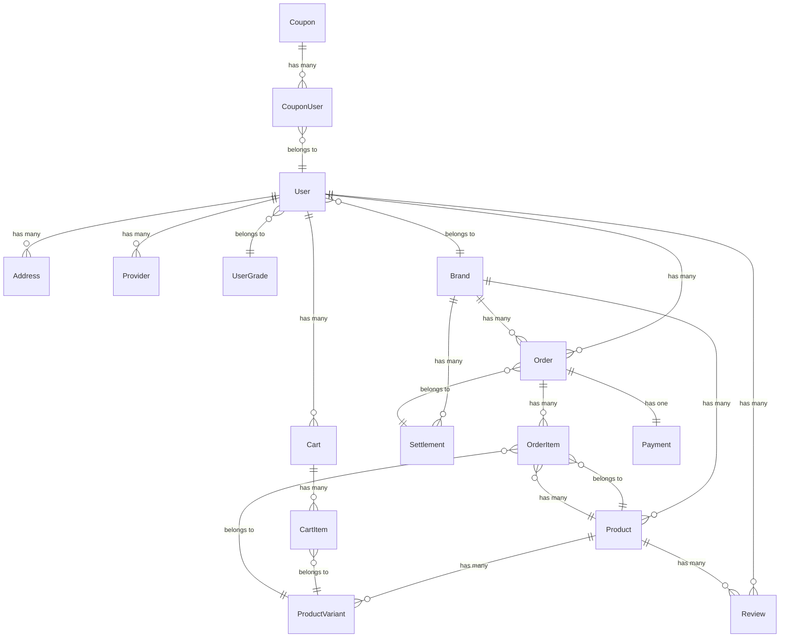

# 🗄️ 데이터베이스 스키마 가이드

## 📋 개요

BogoFit Shop은 PostgreSQL 데이터베이스와 Prisma ORM을 사용하여 데이터를 관리합니다. 이 가이드는 데이터베이스 구조와 각 테이블의 역할을 설명합니다.

## 🏗️ 전체 아키텍처

### ERD (Entity Relationship Diagram)



## 👤 사용자 관리

### User (사용자)

사용자 계정의 기본 정보를 저장합니다.

```sql
CREATE TABLE "User" (
  "id" TEXT PRIMARY KEY DEFAULT uuid(),
  "userId" TEXT UNIQUE NOT NULL,
  "password" TEXT,
  "email" TEXT UNIQUE NOT NULL,
  "name" TEXT NOT NULL,
  "phoneNumber" TEXT UNIQUE,
  "profile" TEXT,
  "gender" TEXT,
  "birthDate" TIMESTAMP,
  "isAdmin" BOOLEAN DEFAULT false,
  "isBusiness" BOOLEAN DEFAULT false,
  "brandId" INTEGER REFERENCES "Brand"("id"),
  "gradeId" INTEGER REFERENCES "UserGrade"("id"),
  "createdAt" TIMESTAMP DEFAULT now(),
  "updatedAt" TIMESTAMP
);
```

**주요 필드:**

- `id`: UUID 기본 키
- `userId`: 사용자 식별자 (중복 불가)
- `email`: 이메일 주소 (로그인 및 알림용)
- `phoneNumber`: 전화번호 (SMS 알림용)
- `isAdmin`: 관리자 권한 여부
- `isBusiness`: 비즈니스 사용자 여부
- `brandId`: 소속 브랜드 ID (비즈니스 사용자인 경우)
- `gradeId`: 회원 등급 ID

### UserGrade (회원 등급)

회원 등급별 혜택을 관리합니다.

```sql
CREATE TABLE "UserGrade" (
  "id" SERIAL PRIMARY KEY,
  "name" TEXT UNIQUE NOT NULL,
  "slug" TEXT UNIQUE NOT NULL,
  "description" TEXT,
  "discountRate" DOUBLE PRECISION DEFAULT 0,
  "pointRate" DOUBLE PRECISION DEFAULT 1.0,
  "freeShipping" BOOLEAN DEFAULT false,
  "minOrderAmount" DOUBLE PRECISION DEFAULT 0,
  "minOrderCount" INTEGER DEFAULT 0,
  "isActive" BOOLEAN DEFAULT true,
  "sortOrder" INTEGER DEFAULT 0,
  "createdAt" TIMESTAMP DEFAULT now(),
  "updatedAt" TIMESTAMP
);
```

**등급별 혜택:**

- `discountRate`: 기본 할인율 (%)
- `pointRate`: 포인트 적립율 (배수)
- `freeShipping`: 무료배송 여부
- `minOrderAmount`: 등급 달성 최소 주문 금액
- `minOrderCount`: 등급 달성 최소 주문 횟수

### Provider (소셜 로그인)

소셜 로그인 계정 정보를 저장합니다.

```sql
CREATE TABLE "Provider" (
  "id" TEXT PRIMARY KEY DEFAULT uuid(),
  "provider" TEXT NOT NULL,  -- 'google', 'kakao'
  "socialId" TEXT NOT NULL,  -- 소셜 서비스의 사용자 ID
  "email" TEXT NOT NULL,
  "userId" TEXT NOT NULL REFERENCES "User"("id") ON DELETE CASCADE,
  "createdAt" TIMESTAMP DEFAULT now(),
  "updatedAt" TIMESTAMP,
  UNIQUE("provider", "socialId")
);
```

### Address (주소록)

사용자의 배송지 정보를 관리합니다.

```sql
CREATE TABLE "Address" (
  "id" SERIAL PRIMARY KEY,
  "userId" TEXT NOT NULL REFERENCES "User"("id"),
  "label" TEXT NOT NULL,      -- '집', '회사' 등
  "recipient" TEXT NOT NULL,  -- 수령인 이름
  "zipCode" TEXT NOT NULL,
  "address1" TEXT NOT NULL,   -- 기본 주소
  "address2" TEXT,            -- 상세 주소
  "phone" TEXT NOT NULL,
  "isDefault" BOOLEAN DEFAULT false
);
```

## 🏷️ 브랜드 관리

### Brand (브랜드)

입점 브랜드 정보를 관리합니다.

```sql
CREATE TABLE "Brand" (
  "id" SERIAL PRIMARY KEY,
  "name" TEXT UNIQUE NOT NULL,
  "slug" TEXT UNIQUE NOT NULL,
  "logo" TEXT,
  "description" TEXT,
  "businessNumber" TEXT,
  "status" "BrandStatus" DEFAULT 'PENDING',
  "isActive" BOOLEAN DEFAULT true,
  "commissionRate" DOUBLE PRECISION DEFAULT 0,
  "bankAccount" TEXT,
  "bankCode" TEXT,
  "accountHolder" TEXT,
  "settings" JSONB,
  "createdAt" TIMESTAMP DEFAULT now(),
  "updatedAt" TIMESTAMP
);

CREATE TYPE "BrandStatus" AS ENUM ('PENDING', 'APPROVED', 'REJECTED', 'SUSPENDED');
```

**브랜드 상태:**

- `PENDING`: 승인 대기
- `APPROVED`: 승인 완료
- `REJECTED`: 승인 거부
- `SUSPENDED`: 일시 중단

## 🛍️ 상품 관리

### Product (상품)

상품의 기본 정보를 저장합니다.

```sql
CREATE TABLE "Product" (
  "id" SERIAL PRIMARY KEY,
  "brandId" INTEGER REFERENCES "Brand"("id"),
  "title" TEXT NOT NULL,
  "slug" TEXT UNIQUE NOT NULL,
  "description" TEXT,
  "detailDescription" TEXT,
  "price" DOUBLE PRECISION NOT NULL,
  "url" TEXT UNIQUE NOT NULL,
  "category" TEXT NOT NULL,
  "subCategory" TEXT,
  "imageUrl" TEXT NOT NULL,
  "badge" TEXT,
  "storeName" TEXT,
  "isActive" BOOLEAN DEFAULT true,
  "detailImage" TEXT,
  "thumbnailImages" TEXT[],
  "status" "ProductStatus" DEFAULT 'PENDING',
  "shippingType" "ShippingType" DEFAULT 'OVERSEAS',
  "totalSales" INTEGER DEFAULT 0,
  "totalSold" INTEGER DEFAULT 0,
  "approvedAt" TIMESTAMP,
  "approvedBy" TEXT,
  "rejectionReason" TEXT,
  "createdAt" TIMESTAMP DEFAULT now(),
  "updatedAt" TIMESTAMP
);

CREATE TYPE "ProductStatus" AS ENUM ('PENDING', 'APPROVED', 'REJECTED', 'DRAFT');
CREATE TYPE "ShippingType" AS ENUM ('DOMESTIC', 'OVERSEAS');
```

**상품 상태:**

- `DRAFT`: 임시 저장
- `PENDING`: 승인 대기
- `APPROVED`: 승인 완료
- `REJECTED`: 승인 거부

**배송 타입:**

- `DOMESTIC`: 국내 배송
- `OVERSEAS`: 해외 배송

### ProductVariant (상품 옵션)

상품의 옵션 정보 (색상, 사이즈 등)를 관리합니다.

```sql
CREATE TABLE "ProductVariant" (
  "id" SERIAL PRIMARY KEY,
  "productId" INTEGER NOT NULL REFERENCES "Product"("id"),
  "optionName" TEXT NOT NULL,   -- '색상', '사이즈'
  "optionValue" TEXT NOT NULL,  -- 'RED', 'XL'
  "priceDiff" INTEGER DEFAULT 0, -- 옵션 추가 가격
  "stock" INTEGER NOT NULL,
  UNIQUE("productId", "optionName", "optionValue")
);
```

## 🛒 장바구니 및 주문

### Cart (장바구니)

사용자별 장바구니 정보를 관리합니다.

```sql
CREATE TABLE "Cart" (
  "id" SERIAL PRIMARY KEY,
  "userId" TEXT NOT NULL REFERENCES "User"("id"),
  "updatedAt" TIMESTAMP
);
```

### CartItem (장바구니 아이템)

장바구니에 담긴 상품들을 관리합니다.

```sql
CREATE TABLE "CartItem" (
  "id" SERIAL PRIMARY KEY,
  "cartId" INTEGER NOT NULL REFERENCES "Cart"("id"),
  "variantId" INTEGER NOT NULL REFERENCES "ProductVariant"("id"),
  "quantity" INTEGER NOT NULL,
  UNIQUE("cartId", "variantId")
);
```

### Order (주문)

주문의 기본 정보를 저장합니다.

```sql
CREATE TABLE "Order" (
  "id" TEXT PRIMARY KEY DEFAULT cuid(),
  "userId" TEXT REFERENCES "User"("id"),
  "orderNumber" TEXT UNIQUE NOT NULL,
  "status" "OrderStatus" DEFAULT 'PENDING',
  "totalAmount" INTEGER NOT NULL,
  "createdAt" TIMESTAMP DEFAULT now(),
  "updatedAt" TIMESTAMP,

  -- 주문자 정보 (비회원 지원)
  "ordererName" TEXT NOT NULL,
  "ordererEmail" TEXT,
  "ordererPhone" TEXT NOT NULL,
  "ordererTel" TEXT,

  -- 배송지 정보
  "recipientName" TEXT NOT NULL,
  "recipientPhone" TEXT NOT NULL,
  "recipientTel" TEXT,
  "zipCode" TEXT NOT NULL,
  "address1" TEXT NOT NULL,
  "address2" TEXT,

  -- 통관 정보
  "customsId" TEXT NOT NULL,

  -- 개인정보 동의
  "agreePrivacy" BOOLEAN DEFAULT true,

  -- 게스트 주문 플래그
  "isGuestOrder" BOOLEAN DEFAULT false,

  -- 브랜드 및 정산 정보
  "brandId" INTEGER REFERENCES "Brand"("id"),
  "totalCommission" DOUBLE PRECISION DEFAULT 0,
  "settlementStatus" "SettlementStatus" DEFAULT 'PENDING',
  "settlementId" TEXT REFERENCES "Settlement"("id")
);

CREATE TYPE "OrderStatus" AS ENUM (
  'PENDING', 'PAID', 'SHIPPING', 'COMPLETED', 'CANCELED', 'FAILED'
);
```

**주문 상태:**

- `PENDING`: 대기중
- `PAID`: 결제완료
- `SHIPPING`: 배송중
- `COMPLETED`: 배송완료
- `CANCELED`: 취소됨
- `FAILED`: 실패

### OrderItem (주문 상품)

주문에 포함된 상품들을 관리합니다.

```sql
CREATE TABLE "OrderItem" (
  "id" SERIAL PRIMARY KEY,
  "orderId" TEXT NOT NULL REFERENCES "Order"("id"),
  "variantId" INTEGER REFERENCES "ProductVariant"("id"),
  "productId" INTEGER REFERENCES "Product"("id"),
  "quantity" INTEGER NOT NULL,
  "unitPrice" INTEGER NOT NULL  -- 주문 시점의 가격
);
```

### Payment (결제)

결제 정보를 관리합니다 (Toss Payments 연동).

```sql
CREATE TABLE "Payment" (
  "id" TEXT PRIMARY KEY DEFAULT cuid(),
  "orderId" TEXT UNIQUE NOT NULL REFERENCES "Order"("id"),
  "userId" TEXT,
  "amount" INTEGER NOT NULL,
  "status" TEXT NOT NULL,  -- 'PENDING', 'SUCCESS', 'FAILED'
  "method" TEXT,           -- 결제 수단
  "paymentKey" TEXT,       -- Toss 결제 키
  "failReason" TEXT,       -- 실패 사유
  "approvedAt" TIMESTAMP,
  "createdAt" TIMESTAMP DEFAULT now(),
  "updatedAt" TIMESTAMP
);
```

## 🎫 쿠폰 시스템

### Coupon (쿠폰)

쿠폰의 기본 정보를 관리합니다.

```sql
CREATE TABLE "Coupon" (
  "id" SERIAL PRIMARY KEY,
  "code" TEXT UNIQUE NOT NULL,
  "type" "CouponType" NOT NULL,
  "value" INTEGER NOT NULL,
  "minOrderAmount" INTEGER DEFAULT 0,
  "validFrom" TIMESTAMP NOT NULL,
  "validTo" TIMESTAMP NOT NULL,
  "isActive" BOOLEAN DEFAULT true
);

CREATE TYPE "CouponType" AS ENUM ('PERCENT', 'FIXED');
```

**쿠폰 타입:**

- `PERCENT`: 할인율 (value = 10 → 10%)
- `FIXED`: 고정 할인 (value = 5000 → ₩5,000)

### CouponUser (사용자 쿠폰)

사용자별 쿠폰 소유 및 사용 이력을 관리합니다.

```sql
CREATE TABLE "CouponUser" (
  "id" SERIAL PRIMARY KEY,
  "couponId" INTEGER NOT NULL REFERENCES "Coupon"("id"),
  "userId" TEXT NOT NULL REFERENCES "User"("id"),
  "issuedAt" TIMESTAMP DEFAULT now(),
  "usedAt" TIMESTAMP,
  "isUsed" BOOLEAN DEFAULT false
);
```

## ⭐ 리뷰 시스템

### Review (리뷰)

상품 리뷰를 관리합니다.

```sql
CREATE TABLE "Review" (
  "id" SERIAL PRIMARY KEY,
  "userId" TEXT NOT NULL REFERENCES "User"("id"),
  "productId" INTEGER NOT NULL REFERENCES "Product"("id"),
  "rating" INTEGER NOT NULL CHECK ("rating" >= 1 AND "rating" <= 5),
  "content" TEXT NOT NULL,
  "imageUrl" TEXT,
  "createdAt" TIMESTAMP DEFAULT now(),
  "updatedAt" TIMESTAMP
);
```

## 💰 정산 시스템

### Settlement (정산)

브랜드별 정산 정보를 관리합니다.

```sql
CREATE TABLE "Settlement" (
  "id" TEXT PRIMARY KEY DEFAULT cuid(),
  "brandId" INTEGER NOT NULL REFERENCES "Brand"("id"),
  "periodStart" TIMESTAMP NOT NULL,
  "periodEnd" TIMESTAMP NOT NULL,
  "settlementDate" TIMESTAMP,
  "totalSales" DOUBLE PRECISION NOT NULL,
  "totalOrders" INTEGER NOT NULL,
  "commission" DOUBLE PRECISION NOT NULL,
  "commissionRate" DOUBLE PRECISION NOT NULL,
  "adjustments" DOUBLE PRECISION DEFAULT 0,
  "finalAmount" DOUBLE PRECISION NOT NULL,
  "status" "SettlementStatus" DEFAULT 'PENDING',
  "bankAccount" TEXT,
  "bankCode" TEXT,
  "accountHolder" TEXT,
  "notes" TEXT,
  "attachments" TEXT[],
  "createdAt" TIMESTAMP DEFAULT now(),
  "updatedAt" TIMESTAMP
);

CREATE TYPE "SettlementStatus" AS ENUM (
  'PENDING', 'PROCESSING', 'COMPLETED', 'FAILED', 'CANCELLED'
);
```

### BrandAnalytics (브랜드 분석)

브랜드별 성과 데이터를 캐시합니다.

```sql
CREATE TABLE "BrandAnalytics" (
  "id" SERIAL PRIMARY KEY,
  "brandId" INTEGER NOT NULL REFERENCES "Brand"("id"),
  "period" TEXT NOT NULL,  -- 'YYYY-MM' or 'YYYY-MM-DD'
  "periodType" "PeriodType" NOT NULL,
  "totalRevenue" DOUBLE PRECISION DEFAULT 0,
  "totalOrders" INTEGER DEFAULT 0,
  "totalProducts" INTEGER DEFAULT 0,
  "averageOrderValue" DOUBLE PRECISION DEFAULT 0,
  "bestSellingProduct" TEXT,
  "totalProductViews" INTEGER DEFAULT 0,
  "conversionRate" DOUBLE PRECISION DEFAULT 0,
  "returnsCount" INTEGER DEFAULT 0,
  "refundsAmount" DOUBLE PRECISION DEFAULT 0,
  "reviewsCount" INTEGER DEFAULT 0,
  "averageRating" DOUBLE PRECISION DEFAULT 0,
  "calculatedAt" TIMESTAMP DEFAULT now(),
  UNIQUE("brandId", "period", "periodType")
);

CREATE TYPE "PeriodType" AS ENUM ('DAILY', 'MONTHLY', 'YEARLY');
```

## 📋 약관 및 로그

### TermsAgreement (약관 동의)

사용자의 약관 동의 이력을 관리합니다.

```sql
CREATE TABLE "TermsAgreement" (
  "id" SERIAL PRIMARY KEY,
  "userId" TEXT NOT NULL REFERENCES "User"("id"),
  "termsType" "TermsType" NOT NULL,
  "termsVersion" TEXT NOT NULL,
  "content" TEXT,
  "isAgreed" BOOLEAN DEFAULT false,
  "ipAddress" TEXT,
  "userAgent" TEXT,
  "isWithdraw" BOOLEAN DEFAULT false,
  "withdrawReason" TEXT,
  "withdrawAt" TIMESTAMP,
  "agreedAt" TIMESTAMP DEFAULT now(),
  "createdAt" TIMESTAMP DEFAULT now(),
  "updatedAt" TIMESTAMP
);

CREATE TYPE "TermsType" AS ENUM (
  'SERVICE', 'PRIVACY', 'MARKETING', 'LOCATION', 'THIRDPARTY'
);
```

### UserLog (사용자 활동 로그)

사용자의 주요 활동을 기록합니다.

```sql
CREATE TABLE "UserLog" (
  "id" SERIAL PRIMARY KEY,
  "userId" TEXT REFERENCES "User"("id"),
  "action" "LogAction" NOT NULL,
  "category" TEXT,
  "description" TEXT,
  "targetType" TEXT,
  "targetId" TEXT,
  "sessionId" TEXT,
  "ipAddress" TEXT,
  "userAgent" TEXT,
  "metadata" JSONB,
  "isSuccess" BOOLEAN DEFAULT true,
  "errorMessage" TEXT,
  "createdAt" TIMESTAMP DEFAULT now(),
  "updatedAt" TIMESTAMP
);

CREATE TYPE "LogAction" AS ENUM (
  'LOGIN', 'LOGOUT', 'REGISTER', 'PASSWORD_RESET',
  'VIEW_PRODUCT', 'ADD_TO_CART', 'REMOVE_FROM_CART',
  'CREATE_ORDER', 'CANCEL_ORDER', 'PAYMENT_SUCCESS', 'PAYMENT_FAIL',
  'WRITE_REVIEW', 'UPDATE_PROFILE', 'BUSINESS_LOGIN', 'BUSINESS_ACTION'
);
```

## 📊 기타 컨텐츠

### Event (이벤트)

마케팅 이벤트 정보를 관리합니다.

```sql
CREATE TABLE "Event" (
  "id" SERIAL PRIMARY KEY,
  "title" TEXT NOT NULL,
  "description" TEXT,
  "imageUrl" TEXT,
  "startAt" TIMESTAMP NOT NULL,
  "endAt" TIMESTAMP NOT NULL,
  "isActive" BOOLEAN DEFAULT true
);
```

### FAQ (자주 묻는 질문)

고객 지원을 위한 FAQ를 관리합니다.

```sql
CREATE TABLE "Faq" (
  "id" SERIAL PRIMARY KEY,
  "question" TEXT NOT NULL,
  "answer" TEXT NOT NULL,
  "createdAt" TIMESTAMP DEFAULT now(),
  "updatedAt" TIMESTAMP
);
```

### Notice (공지사항)

공지사항을 관리합니다.

```sql
CREATE TABLE "Notice" (
  "id" SERIAL PRIMARY KEY,
  "title" TEXT NOT NULL,
  "content" TEXT NOT NULL,
  "createdAt" TIMESTAMP DEFAULT now(),
  "updatedAt" TIMESTAMP
);
```

## 🔗 관계 정의

### 주요 관계 설정

```prisma
// 1:N 관계
User     ||--o{ Address    : userId
User     ||--o{ Order      : userId
Brand    ||--o{ Product    : brandId
Product  ||--o{ Review     : productId

// N:M 관계 (중간 테이블 사용)
User     }o--o{ Coupon     : CouponUser
Cart     }o--o{ ProductVariant : CartItem
Order    }o--o{ ProductVariant : OrderItem

// 1:1 관계
Order    ||--|| Payment    : orderId (unique)
```

### 외래키 제약조건

```sql
-- 연쇄 삭제 (CASCADE)
ALTER TABLE "Provider" ADD CONSTRAINT "Provider_userId_fkey"
  FOREIGN KEY ("userId") REFERENCES "User"("id") ON DELETE CASCADE;

-- 참조 무결성 (RESTRICT)
ALTER TABLE "Product" ADD CONSTRAINT "Product_brandId_fkey"
  FOREIGN KEY ("brandId") REFERENCES "Brand"("id") ON DELETE RESTRICT;

-- NULL 설정 (SET NULL)
ALTER TABLE "Order" ADD CONSTRAINT "Order_userId_fkey"
  FOREIGN KEY ("userId") REFERENCES "User"("id") ON DELETE SET NULL;
```

## 📈 인덱스 설계

### 성능 최적화를 위한 인덱스

```sql
-- 자주 조회되는 필드에 인덱스 생성
CREATE INDEX "idx_product_category" ON "Product"("category");
CREATE INDEX "idx_product_brand_status" ON "Product"("brandId", "status");
CREATE INDEX "idx_order_user_status" ON "Order"("userId", "status");
CREATE INDEX "idx_order_created_at" ON "Order"("createdAt" DESC);

-- 복합 인덱스 (여러 필드 조합)
CREATE INDEX "idx_user_business_brand" ON "User"("isBusiness", "brandId");
CREATE INDEX "idx_settlement_brand_period" ON "Settlement"("brandId", "periodStart", "periodEnd");

-- 부분 인덱스 (조건부)
CREATE INDEX "idx_active_products" ON "Product"("brandId") WHERE "isActive" = true;
CREATE INDEX "idx_approved_products" ON "Product"("category") WHERE "status" = 'APPROVED';

-- 텍스트 검색을 위한 인덱스
CREATE INDEX "idx_product_title_search" ON "Product" USING gin(to_tsvector('korean', "title"));
```

## 🔄 마이그레이션 관리

### Prisma 마이그레이션

```bash
# 새 마이그레이션 생성
npx prisma migrate dev --name add_shipping_type

# 마이그레이션 적용
npx prisma migrate deploy

# 스키마 동기화 확인
npx prisma migrate status

# 데이터베이스 리셋 (개발환경만)
npx prisma migrate reset
```

### 데이터 시딩

```typescript
// prisma/seed.ts
import { PrismaClient } from "@prisma/client";

const prisma = new PrismaClient();

async function main() {
  // 기본 회원 등급 생성
  const userGrades = await prisma.userGrade.createMany({
    data: [
      {
        name: "일반회원",
        slug: "normal",
        discountRate: 0,
        pointRate: 1.0,
        freeShipping: false,
        minOrderAmount: 0,
        minOrderCount: 0,
      },
      {
        name: "VIP",
        slug: "vip",
        discountRate: 5,
        pointRate: 1.5,
        freeShipping: true,
        minOrderAmount: 500000,
        minOrderCount: 10,
      },
    ],
  });

  // 기본 브랜드 생성
  const brand = await prisma.brand.create({
    data: {
      name: "BogoFit",
      slug: "bogofit",
      description: "AI 가상 피팅 전문 패션 브랜드",
      status: "APPROVED",
      commissionRate: 10,
    },
  });

  console.log("시드 데이터 생성 완료");
}

main()
  .catch((e) => {
    console.error(e);
    process.exit(1);
  })
  .finally(async () => {
    await prisma.$disconnect();
  });
```

## 🔍 쿼리 최적화

### N+1 문제 해결

```typescript
// ❌ 비효율적 - N+1 쿼리 발생
const orders = await prisma.order.findMany();
for (const order of orders) {
  const user = await prisma.user.findUnique({ where: { id: order.userId } });
}

// ✅ 효율적 - include로 한 번에 조회
const orders = await prisma.order.findMany({
  include: {
    user: true,
    items: {
      include: {
        product: true,
        variant: true,
      },
    },
  },
});
```

### 페이지네이션

```typescript
// 커서 기반 페이지네이션 (권장)
const products = await prisma.product.findMany({
  take: 20,
  skip: cursor ? 1 : 0,
  cursor: cursor ? { id: cursor } : undefined,
  where: { isActive: true },
  orderBy: { createdAt: "desc" },
});

// 오프셋 기반 페이지네이션 (단순함)
const products = await prisma.product.findMany({
  take: 20,
  skip: (page - 1) * 20,
  where: { isActive: true },
  orderBy: { createdAt: "desc" },
});
```

## 🛡️ 보안 고려사항

### 데이터 접근 제어

```typescript
// RLS (Row Level Security) 개념 적용
const getUserOrders = async (userId: string) => {
  return prisma.order.findMany({
    where: {
      userId, // 자신의 주문만 조회 가능
    },
  });
};

// 브랜드별 데이터 격리
const getBrandProducts = async (brandId: number) => {
  return prisma.product.findMany({
    where: {
      brandId, // 해당 브랜드 상품만 조회
    },
  });
};
```

### 민감한 데이터 처리

```typescript
// 비밀번호는 해시화하여 저장
import bcrypt from "bcrypt";

const hashedPassword = await bcrypt.hash(plainPassword, 10);
const user = await prisma.user.create({
  data: {
    email,
    password: hashedPassword,
  },
});

// 조회 시 민감한 필드 제외
const publicUser = await prisma.user.findUnique({
  where: { id },
  select: {
    id: true,
    name: true,
    email: true,
    // password 제외
  },
});
```

## 📚 참고 자료

- **Prisma 공식 문서**: https://www.prisma.io/docs/
- **PostgreSQL 문서**: https://www.postgresql.org/docs/
- **데이터베이스 설계 가이드**: https://docs.bogofit.kr/database-design

---

**💡 데이터베이스 스키마 변경 시에는 항상 마이그레이션을 통해 안전하게 진행하세요!**
